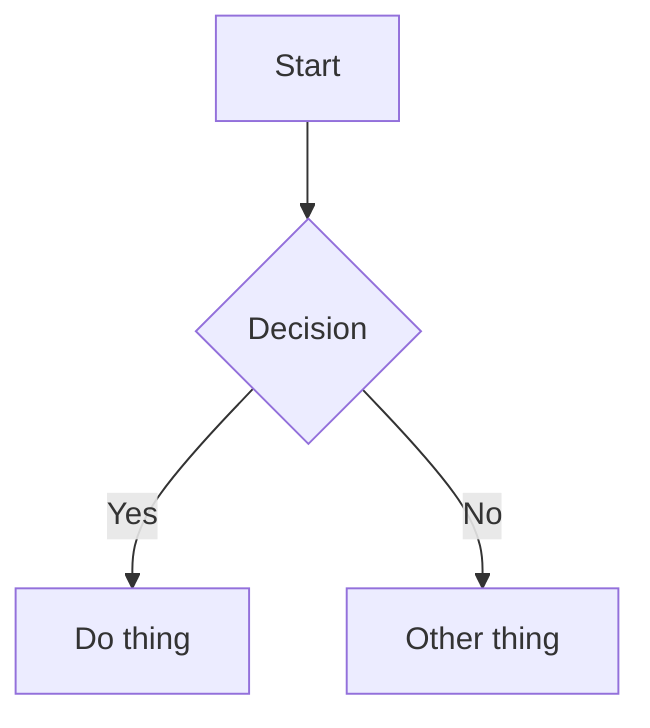

#* OpenMarkdown v1.0 Syntax Tour

This document is a readable tour of the OpenMarkdown v1.0 syntax. It uses each feature in-context so you can see how it renders and how it is written. 
Soft line breaks are preserved inside a paragraph. 

Paragraph breaks only happen when there is a completely blank line between blocks, so you can wrap text manually without forcing a new paragraph.

*How this was written:*
```text
This document is a readable tour of the OpenMarkdown v1.0 syntax. It uses each feature in-context so you can see how it renders and how it is written. 
Soft line breaks are preserved inside a paragraph. 

Paragraph breaks only happen when there is a completely blank line between blocks, so you can wrap text manually without forcing a new paragraph.
```
# Headings
Headings use one to six `#` characters. The title above uses the special `#*`
syntax which is required for OpenMarkdown.

## Inline styles
Inline styles include **bold**, *italic*, ==highlight==, ~strikethrough~, and
`inline code`. Links use the classic `[text](url)` form, like this link to
[OpenMarkdown](https://example.com).

Inline math is wrapped in single dollar signs: $a^2 + b^2 = c^2$.

Images use the standard Markdown image syntax:


# Lists and tasks
Unordered lists use `- ` and task lists use `- [ ]` or `- [x]`.

- A basic list item
- Another item with **emphasis** and a [link](https://openmarkdown.example)
- [ ] Task list item unchecked
- [x] Task list item checked

# Quotes
Blockquotes start with `>` and can contain multiple paragraphs. You can also
nest blockquotes by adding another `>`.

> This is a blockquote that explains how quotes work.
> It can span multiple lines and include **bold** or `code`.
>
> > This is a nested quote.

# Tables
Tables use a header row, a separator row, and then body rows. Alignment is set
with colons in the separator row.

| Feature | Syntax | Notes |
| --- | :---: | ---: |
| Bold | `**text**` | strong emphasis |
| Inline code | `` `code` `` | monospaced |
| Highlight | `==mark==` | simple highlight |

# Code blocks
Code blocks use triple backticks. The info string (like `python`) becomes the
language label above the block.

```python
print("OpenMarkdown v1.0")
for i in range(3):
    print(i)
```

Mermaid diagrams are fenced with `mermaid` as the info string:



# Math blocks
Math blocks can be written as a multiline `$$` block or as a single line using
`$$...$$`.

$$
E = mc^2
\int_0^1 x^2 dx
$$

$$a^2 + b^2 = c^2$$

---

That is the full OpenMarkdown v1.0 feature set. If you need more, bump the
version and add syntax in v1.1.
