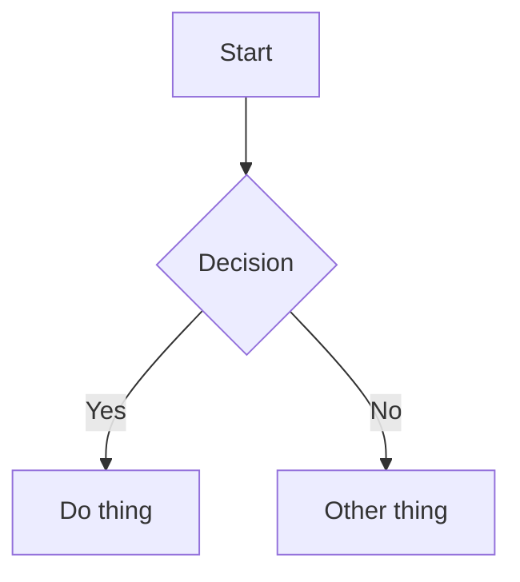

#* OpenMarkdown v1.0 Example

This file showcases every supported block and inline syntax.
It also demonstrates soft line breaks in paragraphs.

# Heading 1
## Heading 2
### Heading 3
#### Heading 4
##### Heading 5
###### Heading 6

---

Inline formatting: **bold**, *italic*, ==highlight==, ~strikethrough~, `inline code`, and a [link](https://example.com).
Inline math: $a^2 + b^2 = c^2$.


> Blockquote line one.
> Blockquote line two with **bold** and `code`.
> 
> > Nested blockquote.

- Basic list item
- Another item with a [link](https://openmarkdown.example)
- [ ] Task list item unchecked
- [x] Task list item checked

| Column A | Column B | Column C |
| --- | :---: | ---: |
| left | centered | right |
| **bold** | `code` | ==mark== |

```text
Plain code block
Line two
```



$$
E = mc^2
\int_0^1 x^2 dx
$$

$$a^2 + b^2 = c^2$$
